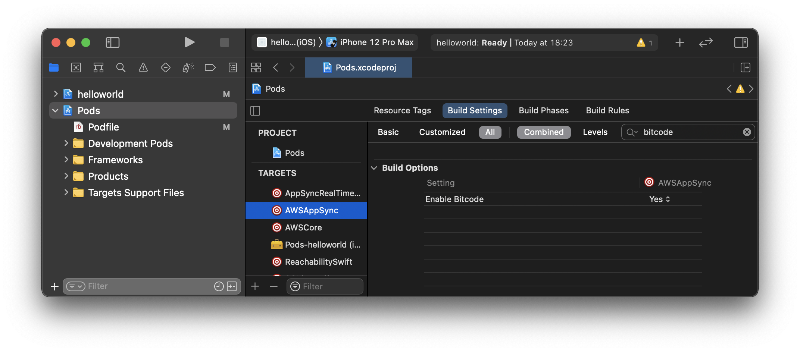
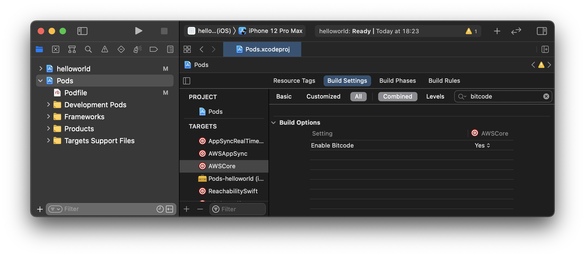

Minimal reproduction repository to demonstrate that the `build_settings_overrides` are not working with [pod_builder](https://github.com/Subito-it/PodBuilder).

# How to reproduce the bug

Please run:

```bash
pod_builder build_all
open helloworld.xcworkspace/
```

Now look at the Pods build settings in XCode.
You'll see that they don't match the `build_settings_overrides` in [PodBuilder/PodBuilder.json](PodBuilder/PodBuilder.json):

```json
"build_settings_overrides": {
    "SBTUITestTunnelClient": {
        "ENABLE_BITCODE": "NO"
    },
    "AWSAppSync": {
        "ENABLE_BITCODE": "NO",
        "IPHONEOS_DEPLOYMENT_TARGET": "10.0"
    },
    "AWSCore": {
        "ENABLE_BITCODE": "NO"
    }
}
```


